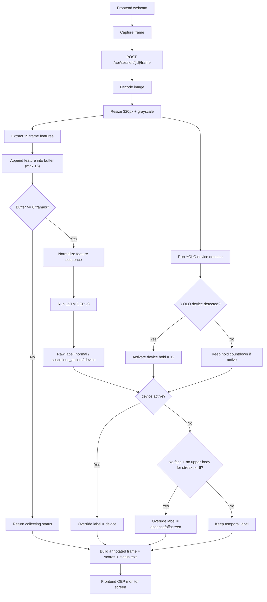
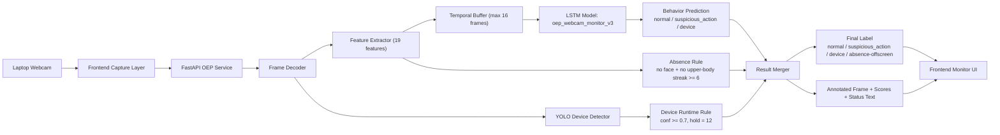

# Present Note

## 1. Mục tiêu của thực nghiệm

Thực nghiệm này nhằm demo một hệ thống giám sát thi trực tuyến bằng `1 camera laptop`, trong đó:

- `Temporal model OEP v3` dùng để phân loại hành vi theo thời gian
- `YOLO runtime` dùng để ưu tiên bắt lớp `device`
- `absence/offscreen rule` dùng để bắt trường hợp mất cả `face` và `upper-body`

Mục tiêu cuối là tạo ra nhãn ổn định cho UI demo:

- `normal`
- `suspicious_action`
- `device`
- `absence/offscreen`

## 2. Input của hệ thống

Input trực tiếp của service là từng frame ảnh từ webcam trình duyệt.

- Frontend mở camera
- Mỗi lần capture, frontend gửi `base64 image` lên API:
  - `POST /api/session/{session_id}/frame`
- Mỗi session có buffer riêng để giữ chuỗi đặc trưng theo thời gian

Payload đầu vào:

```json
{
  "frame": "data:image/jpeg;base64,...",
  "captured_at": "optional"
}
```

## 3. Frame được xử lý như thế nào

Mỗi frame đi qua các bước sau:

1. Decode ảnh từ base64
2. Resize về chiều rộng chuẩn `320`
3. Chuyển grayscale
4. Trích đặc trưng thị giác cho frame hiện tại
5. Chạy YOLO riêng để kiểm tra `device`
6. Đẩy vector đặc trưng vào temporal buffer

## 4. Bộ đặc trưng mỗi frame

Mỗi frame hiện tại được biến thành vector `19` đặc trưng:

- `brightness`
- `motion_score`
- `edge_density`
- `face_present`
- `face_area_ratio`
- `face_center_x`
- `face_center_y`
- `eye_pair_present`
- `eye_distance_ratio`
- `yaw_proxy`
- `pitch_proxy`
- `eye_open_ratio`
- `lower_face_edge_density`
- `multiple_faces_proxy`
- `upperbody_present`
- `upperbody_area_ratio`
- `upperbody_center_x`
- `upperbody_center_y`
- `face_body_relation`

Ý nghĩa:

- nhóm `face + eye` giúp mô tả hướng nhìn, độ mở mắt, vị trí mặt
- nhóm `upper-body` giúp tránh báo vắng mặt khi vẫn còn thân người trong khung hình
- `motion_score` giúp phản ánh thay đổi giữa hai frame liên tiếp

### 4.1 Chi tiết 19 features được build như thế nào

Nguồn chính để follow implementation:

- [feature_extractor.py](/Users/huy.dao/XuLyAnh/anti-cheat-demo/backend/oep_service/feature_extractor.py)
- hàm `extract_frame_features(...)`
- hàm `feature_names()`

Giải thích từng feature:

1. `brightness`
- tính từ giá trị trung bình của ảnh grayscale
- công thức gần đúng: `gray.mean() / 255.0`

2. `motion_score`
- đo mức thay đổi giữa frame hiện tại và frame trước
- dùng `cv2.absdiff(gray, previous_gray).mean() / 255.0`

3. `edge_density`
- mật độ cạnh trong ảnh
- dùng `Canny(gray, 50, 150)` rồi lấy tỷ lệ pixel cạnh

4. `face_present`
- cờ cho biết có detect được mặt chính hay không
- lấy từ `haarcascade_frontalface_default.xml`

5. `face_area_ratio`
- tỷ lệ diện tích mặt so với toàn frame
- giúp biết mặt đang gần hay xa camera

6. `face_center_x`
- tọa độ tâm mặt theo trục ngang, đã normalize về khoảng `0..1`

7. `face_center_y`
- tọa độ tâm mặt theo trục dọc, đã normalize về khoảng `0..1`

8. `eye_pair_present`
- cờ cho biết có detect được ít nhất một cặp mắt hay không
- dùng `haarcascade_eye_tree_eyeglasses.xml`

9. `eye_distance_ratio`
- khoảng cách giữa hai mắt chia cho chiều rộng khuôn mặt
- dùng để phản ánh tương đối góc quay đầu hoặc độ ổn định của face ROI

10. `yaw_proxy`
- độ lệch ngang của trung điểm hai mắt so với tâm mặt
- là một chỉ báo gần đúng cho quay trái hoặc quay phải

11. `pitch_proxy`
- vị trí dọc của trung điểm hai mắt trong face box
- là chỉ báo gần đúng cho cúi xuống hoặc ngẩng lên

12. `eye_open_ratio`
- tỷ lệ chiều cao / chiều rộng trung bình của hai vùng mắt
- được dùng như proxy thô cho trạng thái mở mắt

13. `lower_face_edge_density`
- mật độ cạnh ở nửa dưới khuôn mặt
- giúp mô tả texture vùng miệng, cằm, phần dưới mặt

14. `multiple_faces_proxy`
- cờ cho biết có nhiều hơn một face box trong frame hay không

15. `upperbody_present`
- cờ cho biết có detect được upper-body hay không
- dùng `haarcascade_upperbody.xml`

16. `upperbody_area_ratio`
- tỷ lệ diện tích upper-body so với toàn frame

17. `upperbody_center_x`
- tọa độ tâm upper-body theo trục ngang, normalize `0..1`

18. `upperbody_center_y`
- tọa độ tâm upper-body theo trục dọc, normalize `0..1`

19. `face_body_relation`
- feature tổng hợp giữa vị trí mặt và vị trí body
- hiện tại được build từ:
  - `face_body_offset_x`
  - cộng thêm một phần nhỏ của `face_body_size_ratio`
- mục tiêu là phản ánh tương quan giữa mặt và thân người trong cùng frame

### 4.2 Follow theo đâu để làm lại

Nếu muốn giải thích hoặc re-implement lại pipeline này, nên follow theo thứ tự:

1. `resize_frame(...)`
- chuẩn hóa kích thước frame đầu vào

2. `_select_primary_face(...)`
- detect mặt chính bằng Haar Cascade

3. `_extract_eye_features(...)`
- cắt ROI khuôn mặt rồi detect mắt để lấy `eye_pair_present`, `eye_distance_ratio`, `yaw_proxy`, `pitch_proxy`, `eye_open_ratio`

4. `_select_upper_body(...)`
- detect upper-body để lấy nhóm feature thân người

5. `extract_frame_features(...)`
- đây là hàm gộp toàn bộ feature thành vector 19 chiều

6. `feature_names()`
- đây là nơi định nghĩa thứ tự chính thức của vector

Nói ngắn gọn:

- `feature_extractor.py` là file gốc
- `extract_frame_features(...)` là hàm quan trọng nhất
- `feature_names()` là danh sách tên feature để map đúng thứ tự

## 5. Temporal Buffer hoạt động thế nào

Hệ thống không dự đoán từ một frame đơn lẻ.

Nó giữ một `buffer` theo session:

- `SEQUENCE_FRAMES = 16`
- `MIN_FRAMES_TO_PREDICT = 8`

Điều đó có nghĩa là:

- dưới `8` frame: chỉ thu thập dữ liệu, chưa kết luận
- từ frame thứ `8` trở đi: bắt đầu cho phép dự đoán
- buffer tối đa giữ `16` vector gần nhất

Nói ngắn gọn:

- frame mới vào
- vector mới được append vào `deque(maxlen=16)`
- nếu buffer đủ dài thì model chạy trên toàn bộ chuỗi hiện có

## 6. Temporal Model OEP v3 chạy thế nào

Model hiện dùng là:

- `oep_webcam_monitor_v3`
- loại model: `LSTM`
- số lớp train: `3`
  - `normal`
  - `suspicious_action`
  - `device`

Luồng chạy:

1. Lấy chuỗi feature trong buffer
2. Chuẩn hóa bằng `feature_mean` và `feature_std`
3. Đưa qua `LSTM`
4. Lấy `softmax` để ra xác suất từng lớp
5. Nếu lớp khác `normal` nhưng confidence quá thấp thì ép về `normal` bằng `non_normal_threshold = 0.75`

Kết quả sau bước này là:

- `prediction_label`
- `confidence`
- `probabilities`

## 7. YOLO chạy thế nào

YOLO không thay thế temporal model.

Trong runtime hiện tại, YOLO được dùng như một nhánh độc lập để bắt `device`.

Classes đang quan tâm:

- `cell phone`
- `phone`
- `laptop`

Ngưỡng chính:

- `DEVICE_CONFIDENCE_THRESHOLD = 0.7`

Nếu YOLO thấy device:

- service set `device_hold_remaining = 12`
- lưu `last_device_confidence`
- trong các frame sau, dù YOLO không còn thấy lại ngay, hệ thống vẫn giữ nhãn `device` thêm một số frame để UI ổn định

Đây là lý do có:

- `DEVICE_HOLD_FRAMES = 12`

## 8. Rule absence/offscreen chạy thế nào

`absence/offscreen` không học trực tiếp như một lớp cuối trong output runtime.

Nó được tính bằng rule sau:

- nếu `face_present = false`
- và `pose_present = false`
- trong nhiều frame liên tiếp

Thì tăng `offscreen_streak`.

Ngưỡng hiện tại:

- `OFFSCREEN_STREAK_THRESHOLD = 6`

Khi vượt ngưỡng:

- service override kết quả thành `absence/offscreen`
- confidence tăng dần theo số frame mất tín hiệu

## 9. Merge kết quả diễn ra theo thứ tự nào

Thứ tự merge hiện tại là:

1. Chạy `Temporal model`
2. Nếu `device_active = true` thì override thành `device`
3. Nếu không phải `device` và mất cả `face` lẫn `upper-body` đủ lâu thì override thành `absence/offscreen`
4. Nếu không rơi vào hai rule trên thì giữ kết quả của temporal model

Thứ tự ưu tiên:

1. `device`
2. `absence/offscreen`
3. `normal` hoặc `suspicious_action` từ temporal model

Ý nghĩa thực dụng:

- khi thấy điện thoại rõ, UI phải ưu tiên báo `device`
- nếu không thấy cả người lẫn mặt trong nhiều frame, phải báo `absence/offscreen`
- còn lại dùng model hành vi để phân biệt `normal` và `suspicious_action`

## 10. Output của service là gì

API trả về cho frontend:

- `prediction_label`
- `confidence`
- `probabilities`
- `features`
- `annotated_frame`
- `status_text`
- thông tin `session`

Output này đủ để UI hiển thị:

- camera đã annotate
- nhãn hiện tại
- thanh xác suất
- trạng thái buffer
- thông báo runtime như `Device rule triggered`

## 11. Workflow thực nghiệm

### Sơ đồ trực quan


### Sơ đồ ASCII

```text
Entry: Webcam Frame Stream
        |
        v
+------------------------------+
| Screen 1                     |
| Frontend Camera Capture      |
| - Open webcam                |
| - Capture frame              |
| - Send base64 to API         |
+------------------------------+
        |
        v
+------------------------------+
| Screen 2                     |
| Backend Frame Processing     |
| - Decode image               |
| - Resize to width 320        |
| - Convert to grayscale       |
+------------------------------+
        |
        v
+------------------------------+        +------------------------------+
| Screen 3                     |        | Screen 4                     |
| Feature Extraction           |------->| YOLO Runtime Device Check    |
| - Build 19 features          |        | - phone / laptop             |
| - face / eye / upper-body    |        | - conf >= 0.7                |
+------------------------------+        | - hold = 12 frames           |
        |                               +------------------------------+
        |
        v
+------------------------------+
| Screen 5                     |
| Temporal Buffer              |
| - Store latest 16 frames     |
| - Predict after 8 frames     |
+------------------------------+
        |
        v
+------------------------------+
| Screen 6                     |
| OEP Temporal Model v3        |
| - LSTM inference             |
| - Output 3 classes           |
|   normal                     |
|   suspicious_action          |
|   device                     |
+------------------------------+
        |
        v
+------------------------------+        +------------------------------+
| Screen 7                     |<-------| Screen 8                     |
| Result Merger                |        | Absence / Offscreen Rule     |
| Priority:                    |        | - no face                    |
| 1. device                    |        | - no upper-body              |
| 2. absence/offscreen         |        | - streak >= 6                |
| 3. temporal label            |        +------------------------------+
+------------------------------+
        |
        v
+------------------------------+
| Screen 9                     |
| Final Output                 |
| - prediction_label           |
| - confidence                 |
| - probabilities              |
| - annotated_frame            |
| - status_text                |
+------------------------------+
        |
        v
+------------------------------+
| Done                         |
| Frontend Monitor UI          |
| - Normal                     |
| - Suspicious Action          |
| - Device                     |
| - Absence / Offscreen        |
+------------------------------+
```



## 11.1 Block Diagram



Ý nghĩa của block diagram:

- `Frontend Capture Layer` chịu trách nhiệm lấy ảnh từ webcam và gửi lên backend
- `Feature Extractor` tạo vector đầu vào cho temporal model
- `YOLO Device Detector` là nhánh riêng để bắt điện thoại hoặc thiết bị
- `Temporal Buffer` giúp model nhìn được chuỗi frame thay vì ảnh đơn
- `LSTM Model` dự đoán hành vi tổng quát
- `Result Merger` là nơi hợp nhất dự đoán từ model và các rule runtime
- `Frontend Monitor UI` hiển thị kết quả cuối cùng cho người dùng

## 12. Kết quả đầu ra mong muốn trong demo

Trong demo, hệ thống nên thể hiện được các trạng thái sau:

- `normal`
  - thí sinh ngồi bình thường
  - không bị nhảy sang `device`
- `suspicious_action`
  - có hành vi đáng ngờ về hướng nhìn hoặc tư thế
  - không bị `absence/offscreen` cướp lớp ở sample phù hợp
- `device`
  - khi YOLO thấy điện thoại rõ, nhãn giữ đủ lâu để người xem thấy trên UI
- `absence/offscreen`
  - khi mất cả mặt và upper-body đủ lâu, hệ thống báo vắng mặt

## 13. Ý chính khi thuyết trình

- Hệ thống này không chỉ nhìn một frame đơn lẻ, mà nhìn cả chuỗi `8-16` frame
- `LSTM` học hành vi theo thời gian
- `YOLO` chỉ đóng vai trò bắt `device` theo runtime
- `absence/offscreen` là rule riêng để tránh phụ thuộc hoàn toàn vào model
- Kết quả cuối là sự kết hợp giữa `temporal AI` và `rule practical`, nhằm làm demo ổn định hơn
