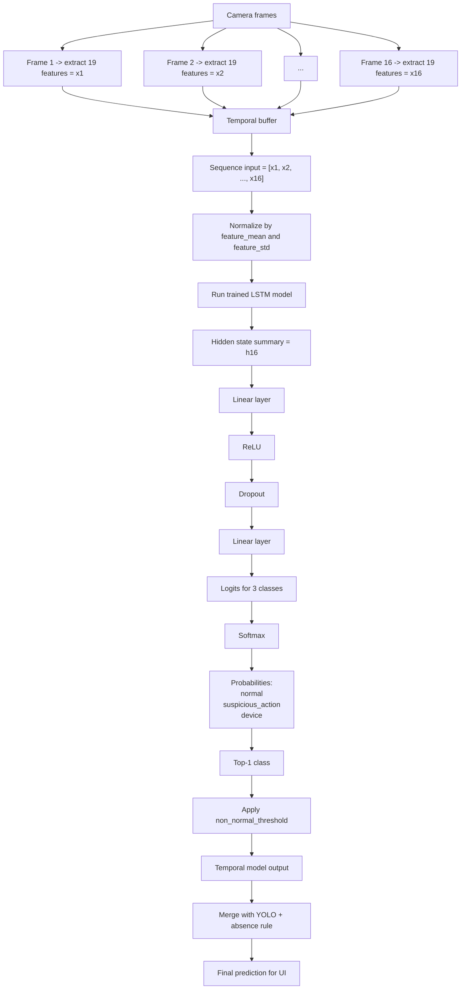

# Trained Model Service Diagram

## 1. Mermaid Diagram



---

## 2. ASCII Diagram

```text
Frame 1  ----> x1 (19 features) \
Frame 2  ----> x2 (19 features)  \
Frame 3  ----> x3 (19 features)   \
...                                >  Temporal Buffer
Frame 16 ----> x16 (19 features)  /
                                  /
                                 v
                 [ x1, x2, x3, ..., x16 ]
                                 |
                                 v
                 Normalize using feature_mean/std
                                 |
                                 v
                         Trained LSTM Model
                                 |
                                 v
                           h16 (summary)
                                 |
                                 v
                     Linear -> ReLU -> Dropout
                                 |
                                 v
                           Linear -> logits
                                 |
                                 v
                              Softmax
                                 |
                                 v
             [normal, suspicious_action, device]
                                 |
                                 v
                       Top-1 + threshold rule
                                 |
                                 v
                       Temporal model decision
                                 |
                                 v
                   Merge with YOLO + absence rule
                                 |
                                 v
                      Final output shown on UI
```

---

## 3. Cách đọc diagram

- Mỗi frame không vào model trực tiếp bằng ảnh thô.
- Mỗi frame trước hết được chuyển thành `1 vector 19 features`.
- Sau khi có đủ `16 frame`, service tạo một chuỗi:

```text
[x1, x2, x3, ..., x16]
```

- Chuỗi này được chuẩn hóa bằng `feature_mean` và `feature_std`.
- Sau đó chuỗi đi qua `trained LSTM model`.
- `h16` là vector tóm tắt của toàn bộ chuỗi sau khi LSTM đọc xong frame cuối.
- `Linear -> ReLU -> Dropout -> Linear` là classifier head.
- `logits` là điểm số thô cho từng lớp.
- `softmax` biến logits thành xác suất.
- Sau đó backend chọn lớp mạnh nhất, áp threshold, rồi merge với:
  - `YOLO device detection`
  - `absence/offscreen rule`

---

## 4. Câu ngắn để thuyết trình

> 16 frame gần nhất được chuyển thành 16 vector đặc trưng, ghép thành một chuỗi thời gian rồi đưa qua mô hình LSTM đã huấn luyện. LSTM tạo ra một vector tóm tắt của toàn bộ chuỗi, sau đó classifier head biến vector này thành xác suất cho các lớp `normal`, `suspicious_action` và `device`. Cuối cùng, kết quả temporal model được hợp nhất với YOLO và absence rule để tạo ra nhãn cuối cùng trên giao diện.
