# Training Model Diagram

## 1. Mục tiêu

Sơ đồ này mô tả pipeline huấn luyện model chính của hệ thống:

- model name: `oep_webcam_monitor_v3`
- model type: `LSTM temporal classifier`
- task: `supervised multi-class sequence classification`

Các lớp đầu ra:

- `normal`
- `suspicious_action`
- `device`

---

## 2. Mermaid Diagram

```mermaid
flowchart TD
    A["OEP Dataset<br/>24 subjects<br/>webcam + wearcam + gt.txt"] --> B["Parse gt.txt<br/>extract labeled segments"]
    B --> C["Infer normal segments<br/>from gaps between cheating events"]
    C --> D["Merge segments<br/>565 labeled + 262 normal = 827 samples"]
    D --> E["Keep webcam-only view<br/>for monitor v3"]
    E --> F["For each segment:<br/>sample 16 timestamps"]
    F --> G["Read 16 frames from webcam video"]
    G --> H["Extract 19 handcrafted features per frame"]
    H --> I["Build one temporal sample<br/>shape = 16 x 19"]
    I --> J["Write dataset<br/>oep_webcam_temporal_v3.jsonl"]
    J --> K["Split by subject<br/>train = 518<br/>val = 167<br/>test = 142"]
    K --> L["Compute feature_mean + feature_std<br/>from train split"]
    L --> M["Normalize temporal features"]
    M --> N["Train LSTM model<br/>input_size = 19<br/>hidden_size = 64<br/>classes = 3"]
    N --> O["Loss = CrossEntropyLoss<br/>Optimizer = Adam<br/>Balanced sampler + class weights"]
    O --> P["Validate every epoch<br/>save best_model.pt"]
    P --> Q["Tune non_normal_threshold<br/>on validation set"]
    Q --> R["Evaluate on test set"]
    R --> S["Export artifacts<br/>best_model.pt<br/>metrics.json<br/>label_map.json"]
    S --> T["Deploy to OEP service<br/>model = oep_webcam_monitor_v3"]
```



---

## 3. Block Diagram

```text
+---------------------------+
|       OEP Dataset         |
| 24 subjects, gt.txt,     |
| webcam video, wearcam    |
+------------+-------------+
             |
             v
+---------------------------+
| Parse segments from gt.txt|
| + infer normal segments   |
+------------+-------------+
             |
             v
+---------------------------+
| Webcam-only segment set   |
| 827 temporal samples      |
+------------+-------------+
             |
             v
+---------------------------+
| Sample 16 frames/segment  |
| Extract 19 features/frame |
+------------+-------------+
             |
             v
+---------------------------+
| Build JSONL dataset       |
| oep_webcam_temporal_v3    |
+------------+-------------+
             |
             v
+---------------------------+
| Split by subject          |
| train / val / test        |
+------------+-------------+
             |
             v
+---------------------------+
| Compute feature stats     |
| mean + std from train     |
+------------+-------------+
             |
             v
+---------------------------+
| Train LSTM classifier     |
| input=19, hidden=64       |
| output=3 classes          |
+------------+-------------+
             |
             v
+---------------------------+
| Validate + save best      |
| Tune threshold            |
| Evaluate on test          |
+------------+-------------+
             |
             v
+---------------------------+
| Export model artifacts    |
| best_model.pt             |
| metrics.json              |
| label_map.json            |
+------------+-------------+
             |
             v
+---------------------------+
| Deploy to service 8001    |
| oep_webcam_monitor_v3     |
+---------------------------+
```

---

## 4. Cách nói ngắn khi thuyết trình

> Từ OEP dataset, nhóm parse các segment hành vi từ `gt.txt`, suy thêm các đoạn `normal`, rồi chỉ giữ nhánh `webcam-only` để phù hợp với bài toán một camera. Mỗi segment được lấy `16 frame`, mỗi frame được trích `19 features`, sau đó tạo thành một sample temporal để huấn luyện mô hình `LSTM` 3 lớp. Sau khi train, nhóm lưu `best_model.pt`, `metrics.json` và deploy model `oep_webcam_monitor_v3` vào service monitor.
